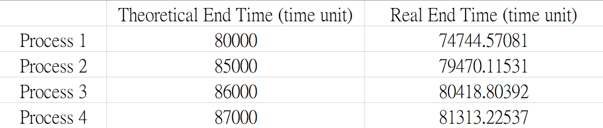
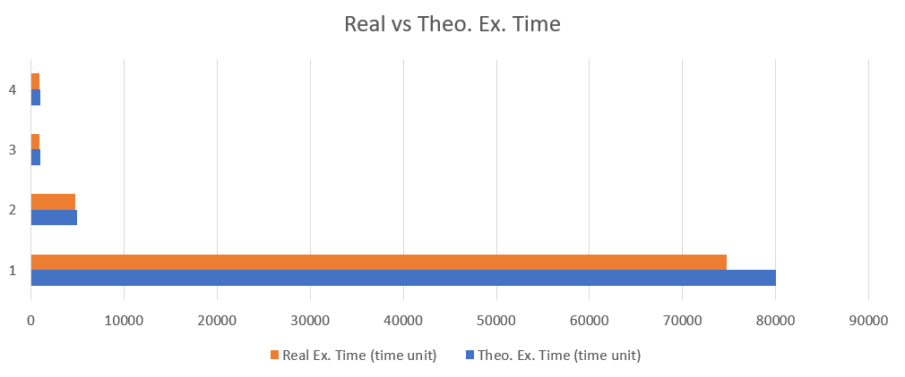

### Reasons Why Actual Outputs are Different from Theoretical Ones

#### Outcome

We know that inaccuracy were inevitable because of other processes' disturbance, CPU properties and scheduling policies, and other numerous reasons. However, there are some "big ones" that resulted in our actual outcome data, meaning that the scale of difference, actual output devided by theoretical output, went up to around 10%.

#### Possible reasons

The real CPU scheduler that runs the entire machine is much more smarter than what we have created. When the process that we created is doing the same things, it becomes more predictable, and makes real CPU job scheduling more easy to be done, resulting in a shorter process execution time.

The test outcome of FIFO_2 supports this theory. Below is the result of FIFO_2:

Plotting the *real vs theoretical execution time* bar graph:

In the above graph, we can see that the real execution time diverges when execution time grows. Because we simulate each tasks with simple loops, the number of loops is directly proportional to the execution time with respect to each process. When real scheduler notices these identical loops, it can speed up the execution since it has already recognized a simple job pattern.

The key thing is, we are using the average execution time of FIFO_1 test data to measure a time unit. Every process in FIFO_1 only lasts for 500 time units. When it comes to other test data, processes last longer. Longer the process runs, more significant the speed up effect is.